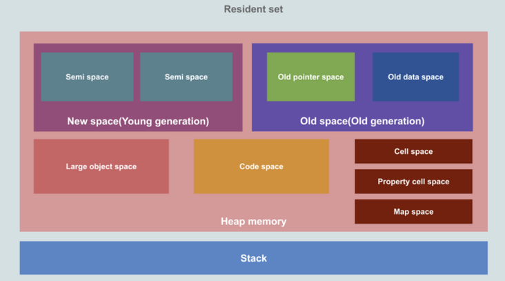
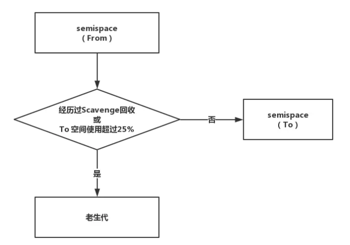

JS 会在创建变量时自动分配内存，在不使用的时候会自动周期性的释放内存，释放的过程就叫 "垃圾回收"。这个机制有好的一面，当然也也有不好的一面。一方面自动分配内存减轻了开发者的负担，开发者不用过多的去关注内存使用，但是另一方面，正是因为因为是自动回收，所以如果不清楚回收的机制，会很容易造成混乱，而混乱就很容易造成"内存泄漏".由于是自动回收，所以就存在一个 "内存是否需要被回收的" 的问题，但是这个问题的判定在程序中意味着无法通过某个算法去准确完整的解决，后面探讨的回收机制只能有限的去解决一般的问题。

<!-- more -->

## 回收算法

垃圾回收对是否需要回收的问题主要依赖于对变量的判定是否可访问，由此衍生出两种主要的回收算法：

- 标记清理
- 引用计数

### 标记清理

标记清理是 js 最常用的回收策略，2012 年后所有浏览器都使用了这种策略，此后的对回收策略的改进也是基于这个策略的改进。其策略是：

1. 变量进入上下文，也可理解为作用域，会加上标记，证明其存在于该上下文；
2. 将所有在上下文中的变量以及上下文中被访问引用的变量标记去掉，表明这些变量活跃有用；
3. 在此之后再被加上标记的变量标记为准备删除的变量，因为上下文中的变量已经无法访问它们；
4. 执行内存清理，销毁带标记的所有非活跃值并回收之前被占用的内存；


#### 局限

- 由于是从根对象(全局对象)开始查找，对于那些无法从根对象查询到的对象都将被清除
- 回收后会形成内存碎片，影响后面申请大的连续内存空间

### 引用计数

引用计数策略相对而言不常用，因为弊端较多。其思路是对每个值记录它被引用的次数，通过最后对次数的判断(引用数为 0)来决定是否保留，具体的规则有

- 声明一个变量，赋予它一个引用值时，计数+1
- 同一个值被赋予另外一个变量时，引用+1
- 保存对该值引用的变量被其他值覆盖，引用-1
- 引用为 0，回收内存

#### 局限

最重要的问题就是，**循环引用** 的问题

```javascript
function refProblem() {
  let a = new Object();
  let b = new Object();
  a.c = b;
  b.c = a; //互相引用
}
```

根据之前提到的规则，两个都互相引用了，引用计数不为 0，所以两个变量都无法回收。如果频繁的调用改函数，则会造成很严重的内存泄漏。

### Nodejs V8 回收机制

V8 的回收机制基于 **分代回收机制** ，将内存分为新生代（young generation）和老生代（tenured generation），新生代为存活时间较短的对象，老生代为存活时间较长或者常驻内存的变量。


#### V8 堆的构成

V8 将堆分成了几个不同的区域


- 新生代（New Space/Young Generation）： 大多数新生对象被分配到这，分为两块空间，整体占据小块空间，垃圾回收的频率较高，采用的回收算法为 Scavenge 算法
- 老生代（Old Space/Old Generation）：大多数在新生区存活一段时间后的对象会转移至此，采用的回收算法为 标记清除 & 整理（Mark-Sweep & Mark-Compact，Major GC） 算法，内部再细分为两个空间

- 指针空间（Old pointer space）: 存储的对象含有指向其他对象的指针
- 数据空间（Old data space）：存储的对象仅包含数据，无指向其他对象的指针
- 大对象空间（Large Object Space）：存放超过其他空间（Space）限制的大对象，垃圾回收器从不移动此空间中的对象
- 代码空间（Code Space）: 代码对象，用于存放代码段，是唯一拥有执行权限的内存空间，需要注意的是如果代码对象太大而被移入大对象空间，这个代码对象在大对象空间内也是拥有执行权限的，但不能因此说大对象空间也有执行权限
- Cell 空间、属性空间、Map 空间 （Cell ,Property,Map Space）： 这些区域存放 Cell、属性 Cell 和 Map，每个空间因为都是存放相同大小的元素，因此内存结构很简单。

### Scavenge 算法

Scavenge 算法是新生代空间中的主要算法，该算法由 C.J. Cheney 在 1970 年在论文 [A nonrecursive list compacting algorithm](https://dl.acm.org/doi/10.1145/362790.362798) 提出。
Scavenge 主要采用了 Cheney 算法，Cheney 算法新生代空间的堆内存分为 2 块同样大小的空间，称为 Semi space，处于使用状态的成为 From 空间 ，闲置的称为 To 空间。垃圾回收过程如下：

检查 From 空间，如果 From 空间被分配满了，则执行 Scavenge 算法进行垃圾回收
如果未分配满，则检查 From 空间的是否有存活对象，如果无存活对象，则直接释放未存活对象的空间
如果存活，将检查对象是否符合晋升条件，如果符合晋升条件，则移入老生代空间，否则将对象复制进 To 空间
完成复制后将 From 和 To 空间角色互换，然后再从第一步开始执行

#### 晋升条件

1. 经历过一次 Scavenge 算法筛选；
2. To 空间内存使用超过 25%；



### 标记清除 & 整理（Mark-Sweep & Mark-Compact，Major GC）算法

之前说过，标记清除策略会产生内存碎片，从而影响内存的使用，这里 标记整理算法（Mark-Compact）的出现就能很好的解决这个问题。标记整理算法是在 标记清除（Mark-Sweep ）的基础上演变而来的，整理算法会将活跃的对象往边界移动，完成移动后，再清除不活跃的对象。


由于需要移动移动对象，所以在处理速度上，会慢于 Mark-Sweep。

### 全停顿（Stop The World ）

为了避免应用逻辑与垃圾回收器看到的逻辑不一样，垃圾回收器在执行回收时会停止应用逻辑，执行完回收任务后，再继续执行应用逻辑。这种行为就是 全停顿，停顿的时间取决与不同引擎执行一次垃圾回收的时间。这种停顿对新生代空间的影响较小，但对老生代空间可能会造成停顿的现象。

### 增量标记（Incremental Marking）

为了解决全停顿的现象，2011 年 V8 推出了增量标记。V8 将标记过程分为一个个的子标记过程，同时让垃圾回收标记和 JS 应用逻辑交替进行，直至标记完成。


### 内存泄漏

内存泄漏的问题难以察觉，在函数被调用很多次的情况下，内存泄漏可能是个大问题。常见的内存泄漏主要有下面几个场景。

#### 意外声明全局变量

```javascript
function hello （）{
    name = 'tom'
}
hello();
```

未声明的对象会被绑定在全局对象上，就算不被使用了，也不会被回收，所以写代码的时候，一定要记得声明变量。

#### 定时器

```javascript
let name = "Tom";
setInterval(() => {
  console.log(name);
}, 100);
```

定时器的回调通过闭包引用了外部变量，如果定时器不清除，name 会一直占用着内存，所以用定时器的时候最好明白自己需要哪些变量，检查定时器内部的变量，另外如果不用定时器了，记得及时清除定时器。

#### 闭包

```javascript
let out = function () {
  let name = "Tom";
  return function () {
    console.log(name);
  };
};
```

由于闭包会常驻内存，在这个例子中，如果 out 一直存在，name 就一直不会被清理，如果 name 值很大的时候，就会造成比较严重的内存泄漏。所以一定要慎重使用闭包。

#### 事件监听

```javascript
mounted() {
window.addEventListener("resize",  () => {
    //do something
});
}
```

在页面初始化时绑定了事件监听，但是在页面离开的时候未清除事监听，就会导致内存泄漏。
